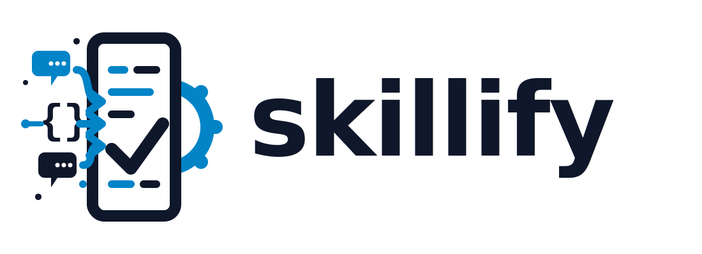

<p align="center">
  <picture>
    <source media="(prefers-color-scheme: dark)" srcset="assets/skillify-banner-dark.svg">
    <source media="(prefers-color-scheme: light)" srcset="assets/skillify-banner-light.svg">
    
  </picture>
</p>

<h3 align="center"><em>Conversations Are Prototypes. Skills Are Artifacts.</em></h3>

<p align="center">
  <a href="https://github.com/nickommen/skillify/actions/workflows/ci.yml"></a>
  
  <a href="LICENSE"></a>
  <a href="https://nickommen.github.io/skillify/"></a>
</p>

---

Skillify converts a Claude Code conversation — where you iterated on automating a task — into a deterministic Python-scripted skill. It parses the conversation, extracts the workflow, and generates Python scripts + a SKILL.md wrapper. Future runs are deterministic, using AI only for error recovery and semantic summarization.

## Prerequisites

- Python 3.12+
- Claude Code with skill support

## Installation

```bash
git clone https://github.com/nickommen/skillify.git
cd skillify
./install.sh
```

Or manually:

```bash
git clone https://github.com/nickommen/skillify.git
ln -sf "$(pwd)/skillify" ~/.claude/skills/skillify
```

After installation, `/skillify` will be available in Claude Code.

## Usage

```bash
# Skillify the current conversation
/skillify
/skillify this

# Skillify a specific past conversation by session ID
/skillify 15555f6f-ed1d-47fb-b542-efdaff259864
```

Also triggers on natural language: "turn this into a skill", "make this a skill", "create a skill from this conversation", "convert this to a skill"

## How It Works

1. **Identify** the source conversation — current session or explicit session UUID
2. **Parse** the conversation JSONL into a compact workflow manifest
3. **Interview** the user to confirm skill name, description, save location, and workflow steps
4. **Check** if the conversation already produced Python scripts — reuse if possible
5. **Generate** Python scripts, validators, and SKILL.md via an Agent reading the manifest
6. **Preview** generated files for user confirmation before writing
7. **Write and validate** generated Python syntax and YAML frontmatter
8. **Report** created files, tool dependencies, env vars needed, and how to invoke

## Generated Skill Structure

```text
skill-name/
  SKILL.md              # Orchestration procedure (under 500 lines)
  README.md             # Documentation and setup instructions
  scripts/
    run.py              # Main deterministic script (stdlib-only)
    validators.py       # Precondition checks and output validation
  skill.schema.json     # Input/output schema (when applicable)
```

Generated skills are **deterministic**, **composable** (invokable via `/skill-name`), and **self-validating**.

## Documentation

Full documentation is available at [nickommen.github.io/skillify](https://nickommen.github.io/skillify/).

## Contributing

See [CONTRIBUTING.md](CONTRIBUTING.md) for development setup and guidelines.

## License

[MIT](LICENSE)
